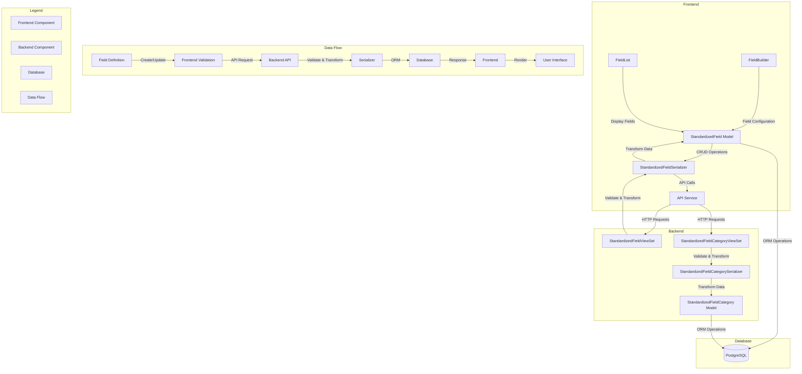

# Standardized Fields Flowchart

## Flowchart Explanation

### Frontend Components
1. **StandardizedFieldManagement**
   - Main component for managing fields
   - Handles CRUD operations
   - Manages field categories
   - Controls pagination and search

2. **FieldBuilder**
   - Builds and edits field definitions
   - Configures validation rules
   - Sets up relationships
   - Manages field options

3. **FieldList**
   - Displays standardized fields
   - Shows field categories
   - Indicates validation status
   - Displays relationships

4. **StandardizedFieldService**
   - Handles API communication
   - Manages data transformation
   - Handles error cases
   - Provides type safety

5. **API Service**
   - Centralized API client
   - Handles authentication
   - Manages request/response
   - Provides error handling

### Backend Components
1. **StandardizedFieldViewSet**
   - Handles field-related API endpoints
   - Processes CRUD operations
   - Manages pagination
   - Handles filtering and search
   - Enforces permissions

2. **StandardizedFieldCategoryViewSet**
   - Handles category-related API endpoints
   - Processes category operations
   - Manages category relationships
   - Enforces permissions

3. **Serializers**
   - Handle data validation
   - Transform data between frontend and backend
   - Manage field relationships
   - Enforce data integrity

4. **Models**
   - Define database schema
   - Handle ORM operations
   - Enforce data constraints
   - Manage relationships

### Data Flow
1. **Field Definition**
   - Admin creates/updates fields through frontend
   - Frontend validates input
   - Data is sent to backend via API

2. **Backend Processing**
   - API endpoints receive requests
   - Serializers validate and transform data
   - Models handle database operations
   - Response is sent back to frontend

3. **Frontend Processing**
   - API responses are processed
   - Data is transformed for display
   - UI is updated accordingly
   - User feedback is provided

4. **Security Flow**
   - All requests include authentication
   - Backend enforces permissions
   - Data validation at multiple levels
   - Secure database access

### Key Changes from Previous Version
1. Added Models layer in backend
2. Corrected data flow to show proper ORM usage
3. Clarified serializer role in data transformation
4. Updated backend processing flow
5. Added proper database access through models 